# 机箱

简要介绍APPOTRONICS超短焦激光投影仪的机箱外观和功能设置。

APPOTRONICS超短焦激光投影仪的机箱是一个白色立方箱体，主要由接口与按钮组成。

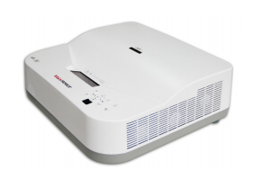

## 外观

介绍投影仪的外观。

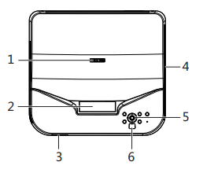
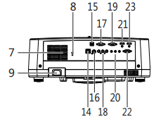
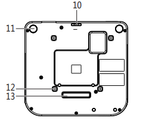

1. 调焦圈

2. 投射镜头

3. 扬声器

4. 通风孔(排热空气)

5. 控制面板

6. 红外遥控传感器

7. 通风孔(进风口)

8. Kensington 防盗锁插槽

9. AC 电源线插口

10. 防落固定孔

11. 后调节支脚

12. 吊顶安装孔(M4x16 螺丝孔) 

13. 前支撑脚 

14. RJ45 网线插口

15. USB 输入插口(工程调试接口) 

16. S- 视频输入插口

17. 电脑(VGA)输出插口

18. AV 输入插口 (视频 / 音频左 / 音频右) 

19. 电脑(VGA)输入插口

20. MIC/ 电脑音频输入 / 音频输出插口

21. HDMI2 输入插口

22. RS232 控制端口

23. HDMI1 输入插口

## 控制单元

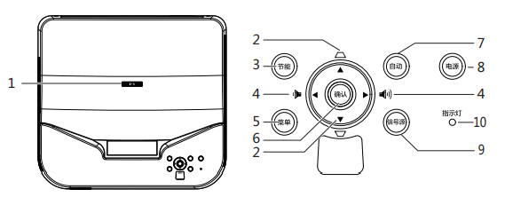

介绍投影仪的控制单元。

1. 调焦圈:调节投影图像的聚焦清晰度。

2. 梯形失真校正 / 箭头键:手动校正因投影角度而产生的扭曲图像。当屏显用户菜单时，可选择 所需的菜单

项。 

3. 节能键:手动选择节能模式打开或关闭

4. 音量大小 / 箭头键(< 向左、> 向右): 按“<””>”可在用户菜单左右选择项目; 按“<””>”可对音 量进行设置。

5. 菜单键:打开屏显菜单，退出并保存菜单设置。

6. 确认键:选择 / 确认当前数值或选择项目。

7. 自动键:信号源重新锁定。

8. 电源键(开机、关机): 按一下开机，在开机状态下连续按两下关机。 

9. 信号源:切换选择不同信号源。

10. 指示灯:显示投影机的状态。 当指示灯亮绿灯闪烁时，表示投影机处于异常保护状态。

## 输入接口

详细介绍投影仪的三种输入接口:AV 输入插口、S- 视频输入插口、VGA、HDMI。

AV 输入插口:分为了3条线，分别为:音频接口(红色与白色线，组成左右声道)和视频接口(黄色)。

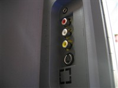
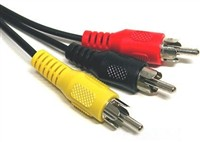

S-视频输入插口:S端子可以说是AV端子的改革，在信号传输方面不再将色度与亮度混合输出，而是分离进 行信号传输，所以我们又称它为“二分量视频接口”。

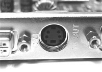
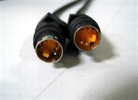

VGA输入接口:VGA接口又称(S-Dub)，这是源于电脑的输入接口，由于CRT显示器无法直接接受数字信号 的输入，所以显卡只能采取将模拟信号输入显示器的方式来获得画面。而VGA就是将模拟信号传输到显示器 的接口。

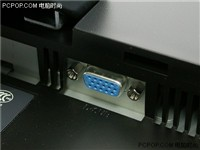
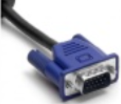

HDMI输入接口:HDMI接口不但可以提供全数字的视频信号，而且还可以同时传输音频。

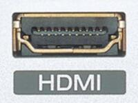
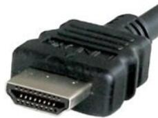