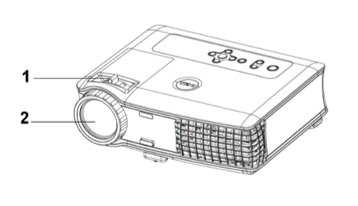
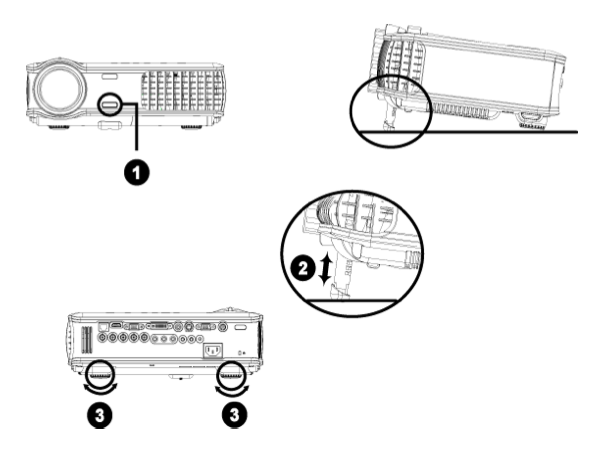

调整
====

在使用投影仪前，可调节投影仪的高度和焦距，以获得最佳投影效果。

调整投影仪焦距
--------------

**Note: 【警告】**

为避免损坏投影仪，请确保在搬动投影仪或将其放入包装箱以前变焦镜头与升降支架
脚完全缩回

1. 旋转调焦片来放大或缩小
2. 旋转调焦环直到图像清晰。投影仪的聚焦范围为4.9英尺到39.4英尺(1.5米到12米)。

.. raw:: html

   <table>
   <tr>
   <td>

1

.. raw:: html

   </td>
   <td>

调焦片

.. raw:: html

   </td>
   </tr>
   <tr>
   <td>

2

.. raw:: html

   </td>
   <td>

调焦环

.. raw:: html

   </td>
   </tr>
   </table>

调整投影仪高度
--------------

提升/降低投影仪高度:

1. 按下升降支架按钮。
2. 升高或降低投影仪以获得所需的显示角度，然后再松开按钮将升降支架脚位置锁定。
3. 用倾斜调整轮来细调显示角度。

|image0|

.. raw:: html

   <table>
   <tr>
   <td>

1

.. raw:: html

   </td>
   <td>

升降支架按钮

.. raw:: html

   </td>
   </tr>
   <tr>
   <td>

2

.. raw:: html

   </td>
   <td>

升降支架脚

.. raw:: html

   </td>
   </tr>
   <td>

3

.. raw:: html

   </td>
   <td>

倾斜调整轮

.. raw:: html

   </td>
   </tr>
   </table>

