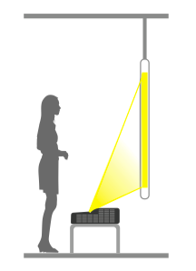
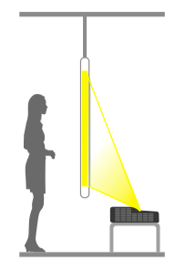
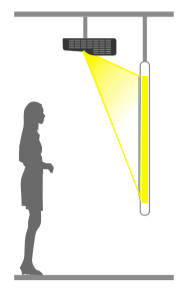
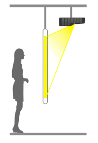

# 安装

介绍安装方式、安装距离

## 安装距离

机型、幕布尺寸不同，投影距离就会不同 根据不同机型差异和不同屏幕尺寸要求，请参照以下表格确定投影距离:

**Note: 【警告】**

+ 从墙壁或天花板上悬吊投影机时，需要特殊的安装方法。如果未正确安装，可能坠落并造成意外及受伤。

+ 请勿盖住投影机的进风口或排气口。如果盖住其中一个通气口，可能导致内部温度上升而发生关机。 

+ 需要吊顶安装时，请联系专业人员安装。

+ 预设的投影方式设定为桌面前投，您可以从菜单选项变更其他投影方式设定: 菜单 --- 设置 --- 安装方式 (吊顶背投 / 吊顶前投 / 桌面背投 / 桌面前投)

## 安装方式

投影仪的4种安装方式
   
本投影机支持以下四种投影方式，请根据安装位置的情况安装投影机。
   
在变更投影方式时，请关闭投影机，并与投影方式变更完成后再开启投影机。预设的投影方式设定为桌面前投，您可以从菜单选项变更其他投影方式。

+ 桌面前投:从投影屏前方投射影像。

+ 桌面背投:从半透明投影屏后方投射影像。

+ 吊顶前投:在墙壁或天花板吊挂投影机，并从投影屏前方投射影像。

+ 吊顶背投:吊顶背投 在墙壁或天花板吊挂投影机， 并从半透明投影屏后方投射影像。

**Note**: 分辨率为 1920x720 的机型不支持桌面前投和桌面背投，预设的投影方式设定为吊顶前投。

  
